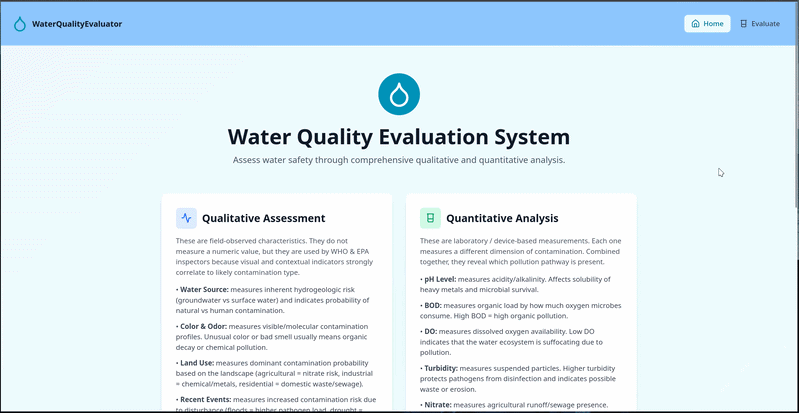

# Water Risk Evaluator (Prototype)

## 🌊 Project Overview
This project is a specialized decision-support tool designed to evaluate water safety. By processing both **quantitative** (numerical) and **qualitative** (descriptive) data, the application assesses whether a water source is safe for humans, plants, or animals.

The goal of this prototype is to transform raw environmental data into actionable safety insights, providing a clear risk profile across three distinct biological categories.

---

  

## ⚙️ How It Works
The evaluator simplifies complex water analysis into a streamlined process through a user-friendly interface:

### 1. Qualitative Inputs (Descriptive)
Users select observations from pre-defined dropdown menus. These factors are critical for capturing "on-the-ground" data that sensors might miss:
* **Sensory Factors:** Taste, Smell, and Color.
* **Environmental Factors:** Geological context (type of terrain) and current Weather conditions.

### 2. Quantitative Inputs (Numerical)
Users provide the measured **Water Quality Index** (WQI)—a summarized numerical value (based on parameters like pH, dissolved oxygen, and minerals) that represents the overall health of the water.

### 3. Smart Assessment & Recommendations
The **Random Forest** model (a machine learning algorithm that uses multiple decision paths to find a result) analyzes the inputs to provide:
* **Safety Status:** Categorized as **Safe**, **Unsafe**, or **Risky**.
* **Tailored Recommendations:** Specific guidance for all three use cases (**Human**, **Animal**, and **Plant**) based on their unique biological needs.

---

## 📊 Dataset & Training

### **Data Source**
The intelligence of this prototype is built upon a robust dataset sourced from **Kaggle**, consisting of over **5,000 rows** of water quality data. This extensive data pool allows the model to recognize patterns between environmental conditions and safety outcomes.

### **Training Environment**
The machine learning model was developed and trained using **Google Colab**. This cloud-based environment provided the necessary computational power to:
* Clean and preprocess the 5,000+ rows of Kaggle data.
* Fine-tune the **Random Forest** hyperparameters (the settings that control how the algorithm learns).
* Export the final trained model for use in the FastAPI backend.
Google Collab Link: https://colab.research.google.com/drive/1WSxkIgr4D980w_E2wPr9oOuTpycaQ8zf?usp=sharing
---

## 🛠️ Technical Architecture

* **Backend:** **FastAPI** (a high-performance tool used to build web connections) handles the data processing and serves the machine learning model.
* **Machine Learning:** **Random Forest** Classifier used for its ability to handle both categorical (dropdowns) and numerical (index) data effectively.
* **Frontend:** **React** provides a responsive dashboard for real-time interaction and result visualization.

---

## 🔍 Evaluation Logic
The tool evaluates water through three distinct lenses:

1.  **Human Consumption:** Focuses on strict safety thresholds and the presence of pathogens (tiny organisms that cause disease).
2.  **Agricultural Use (Plants):** Evaluates salinity (salt content) and mineral levels that could affect soil health or crop growth.
3.  **Livestock & Wildlife (Animals):** Assesses suitability based on the different tolerance levels of various animal species.

---

## 🚀 Current Status
This is a **Proof of Concept** (a small-scale model used to prove an idea is feasible). It demonstrates how machine learning can bridge the gap between sensory observations and numerical data to provide a holistic view of water safety.

---

## 📄 License
This prototype is for evaluation and development purposes.
